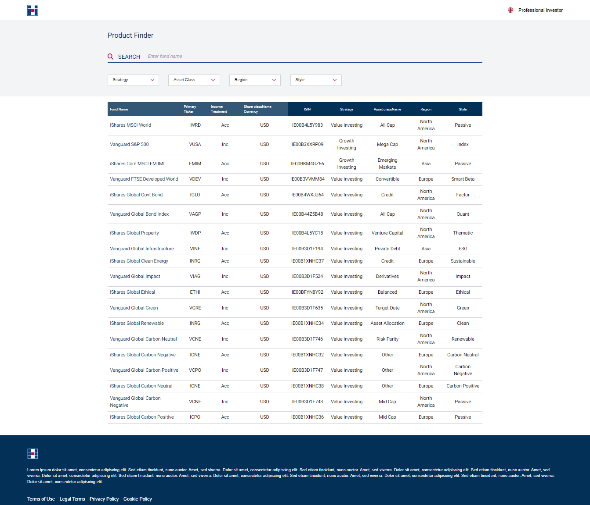

## Getting Started

### Preview



### Quick view via Netlify
https://master--hugue-table.netlify.app/

### Getting Started

In the project directory, you should run:

```bash
npm i
```

This will install the npm packages

```bash
npm run dev
```

Open [http://localhost:3000](http://localhost:3000) with your browser to see the result.

### Usage

You should see a table with data, now let's try apply some filters:

1. For `Strategy` select `Value Investing`
2. For `Asset Class` select `All Cap` and `Mid Cap`
3. For `Region` select `North America`
4. For `Style` select `Passive`
5. Now in the search bar start to search for `Vanguard`

Each step should slowly filter down the table data until you reach one result. Of course you can select and apply the filters however you like. Refresh to reset the filters.

### Tests

Added some basic tests with Jest just to showcase how I would approach testing.

```bash
npm run test
```

- run tests to see that they pass
- there does seem to be a console error referencing 'fetchPriority' which seems to be caused by Next/Image and only while using Jest so I'm not addressing it as it should be fixed in a newer version
- Would like to add tests for the filter behaviours happy paths
- Would like to add tests to check the table handles edge cases such as empty table data, extreme table data, special characters and case sensitivity, combined filters and accessibility

### Further Improvements and Thoughts

#### Feature Improvements

- Clear all filters button
- Style the dropdown scrollbar
- Add scrolling/pagination to the table when entries exceed a number
- Click column to sort alphabetically
- Close dropdown on clickOff
- **Major:** Sort the Asset Classes into categories to show the category name in the dropdown as well as the table
- Add Market filter as part of the Region filter
- Sort regions by group

#### Code improvements

- Refactor the filter states to not require an extra array to hold active filters
- Need to rethink how we will structure the data types for Asset Class and Region to accommodate them living under separate categories.
- Address wet code in the Table component which will in turn reduce code and increase readability and usability.

### Conclusion

A very fun take home project with a lot of room for improvement. It seems simple at first but multi select dropdowns are never easy to manage. Thanks for taking the time to review this test and I hope you like it!
